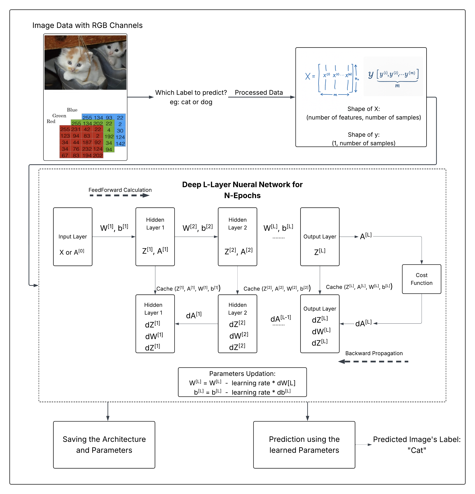

# Deep-L-Layer-Neural-Network-From-Scratch
A python package that implements a deep L‑layer neural network from scratch using NumPy, with configurable architectures and support for ReLU, tanh, and sigmoid activations. It also provides a complete training pipeline—feed‑forward, loss computation, back‑propagation, parameter updates—and seamless model persistence via save/load methods.

## Network Architecture

The deep L‑layer network consists of:

* **L** layers (input + hidden + output)
* Weight matrices `W[L]` and bias vectors `b[L]` for each layer
* Activations: ReLU/tanh for hidden layers, sigmoid for output



---

## Usage

```python
from dnn import DNN

# Define a network: [input_dim, 64, 32, output_dim]
model = DNN([3072, 64, 32, 1])

# Train the model
parameters, costs = model.train(
    X_train, y_train,
    task='classification',
    epochs=500,
    learning_rate=0.01,
    hidden_activation='relu',
    final_activation='sigmoid',
    print_cost=True
)

# Evaluate accuracy
accuracy = model.score(X_test, y_test) * 100
print(f"Test Accuracy: {accuracy:.2f}%")
```

---

## Data Preparation

Before training, prepare your image data:

1. **Flatten & Normalize**

   * Convert each `(H, W, 3)` image to a vector of shape `(H×W×3, m)`.
   * Scale pixel values by `1/255`.
2. **Labels Vector**

   * Create a row vector `y` of shape `(1, m)` containing class labels.

*Feature matrix `X` and label vector `y` after flattening and normalization.*


## Training Pipeline

1. **Feed-Forward**
   Compute activations `A[l]` for `l = 1...L` using:
   $Z^{[l]} = W^{[l]}A^{[l-1]} + b^{[l]},$
   then apply the chosen activation to get `A[l]`.

2. **Cost Computation**
   Compute cross-entropy loss:
   $\mathcal{J} = -\frac{1}{m} \sum [y\log A^{[L]} + (1-y)\log(1-A^{[L]})].$

3. **Backward-Propagation**
   Compute gradients `dW[l]`, `db[l]`, and propagate errors layer by layer.

4. **Parameter Update**
   Gradient descent:
   $W^{[l]} \leftarrow W^{[l]} - \alpha \, dW^{[l]},$
   $b^{[l]} \leftarrow b^{[l]} - \alpha \, db^{[l]}.$

Repeat for N epochs, tracking cost history.

---

## Evaluation

After training, use:

```python
# Binary predictions and probabilities
y_pred  = model.predict(X_test)
y_score = model.predict_proba(X_test)
```

Compute metrics such as accuracy, confusion matrix, and ROC-AUC.

---

## Model Persistence

Save trained model:

```python
model.save_parameters('model.pkl')
```

Load later:

```python
model2 = DNN([])
model2.load_parameters('model.pkl')
```

---

## Roadmap

* Xavier & He weight initialization
* Leaky ReLU and Softmax activations
* Hyperparameter tuning utilities
* CNN and RNN modules
* GPU support via CuPy

---

## Installation

```bash
# Clone the repository
git clone https://github.com/<your-username>/Deep-L-Layer-Neural-Network-From-Scratch.git
cd Deep-L-Layer-Neural-Network-From-Scratch
```


